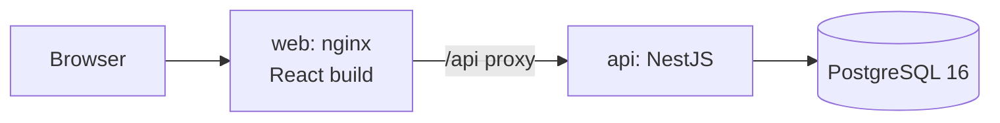

# Intelligent Inventory Dashboard

A dashboard that shows car-dealership managers which vehicles are costing them money, and makes sure someone acts on each one.

- **Scenario:** Supply domain, *Intelligent Inventory Dashboard*: give dealership managers a real-time overview of their vehicle stock.
- **System design:** see [`SYSTEM_DESIGN.md`](SYSTEM_DESIGN.md) for the architecture diagrams, data flow, technology choices, observability and cloud plan.

## Contents

1. [Core requirements](#core-requirements)
2. [Build, run and test](#build-run-and-test)
3. [Architecture](#architecture)
4. [Key business rules](#key-business-rules)
5. [Test suite](#test-suite)
6. [AI Collaboration Narrative](#ai-collaboration-narrative)
7. [Assumptions and trade-offs](#assumptions-and-trade-offs)
8. [Roadmap](#roadmap)

## Core requirements

| # | Requirement | How it is met |
| --- | --- | --- |
| 1 | **Inventory visualization**: filterable list of all vehicles (make, model, age) | Inventory table with filters for make, model, year, age, age bucket, price, latest action, needs-attention badge and status; free-text search; server-side sorting and paging; filters stored in the URL (bookmarkable); CSV export of the filtered view |
| 2 | **Aging stock identification**: vehicles in stock for more than 90 days | Age is computed in SQL on every query in the dealership's timezone, so it never goes stale. Buckets: Fresh 0–30, Normal 31–60, Watch 61–90, Aging 91+. A paginated aging section at the top of the inventory page shows count, share of stock, capital tied up and holding cost. The threshold is configurable. |
| 3 | **Actionable insights**: log and persist a status or proposed action per aging vehicle | Append-only action log (Price Reduction Planned, Price Reduced, Marketing Push, Transfer Planned, Send to Auction, Reconditioning, On Hold) with notes, target dates and new prices. Price Reduced updates the list price and price history in one transaction. Badges flag *No action*, *Stale action* and *Overdue plan*. Rule-based suggestions, bulk actions up to 100 vehicles, and 24-hour note edits. |

## Build, run and test

### Option A: Docker (recommended)

Requires only **Docker** (Docker Desktop on Windows/macOS).

```bash
cp .env.example .env              # PowerShell: Copy-Item .env.example .env
docker compose up -d --build --wait
```

| What | URL |
| --- | --- |
| **Web app** | http://localhost:8080 |
| API docs (Swagger) | http://localhost:3000/api/docs |
| Health check | http://localhost:8080/api/health |

**Demo login:** `manager@demo.local` / `Password123!` (also shown on the login page).

On first start the database is migrated and seeded with about 210 vehicles. Every date is relative to the day you run it, so the demo always looks the same.

```bash
docker compose logs -f api        # follow API logs
docker compose down               # stop (keeps data)
docker compose down -v            # stop and wipe data (fresh demo next start)
```

### Option B: Local development (hot reload)

Requires **Docker**, **Node.js 22+** and **pnpm 10** (`corepack enable`). Stop the Docker stack first, because both use port 3000.

```bash
pnpm install
cp .env.example .env
docker compose -f docker-compose.dev.yml up -d   # Postgres only
pnpm --filter @ims/shared build
pnpm db:migrate
pnpm db:seed
pnpm dev                                          # API :3000, web :5173 (proxies /api)
```

### Build

```bash
pnpm build                        # shared → api → web
docker compose build              # API and web images
```

### Test

```bash
pnpm lint && pnpm typecheck       # static checks
pnpm test                         # unit + component tests (shared, API, web)
pnpm test:e2e                     # API end-to-end tests against a real Postgres (Docker must be running)
```

| Script | Does |
| --- | --- |
| `pnpm dev` | API and web in watch mode |
| `pnpm build` | Build shared, API and web |
| `pnpm lint` / `pnpm typecheck` | ESLint / TypeScript across the repo |
| `pnpm test` | Unit and component tests |
| `pnpm test:e2e` | API end-to-end tests (Testcontainers starts Postgres automatically) |
| `pnpm db:migrate` / `pnpm db:seed` / `pnpm db:reset` | Database tasks |

## Architecture



- **Monorepo (pnpm):** `apps/api` (NestJS 11 + Prisma 6), `apps/web` (React 18 + Vite), `packages/shared` (business rules and API types used by both).
- **One source of truth for rules:** the web form and the API both validate actions with `validateActionInput` from `@ims/shared`. Bucket boundaries in SQL are tested against the shared `bucketFor`.
- **Aging in SQL:** one parameterised query (`vehicleSummary(now, dealershipId)`) computes age, bucket, holding cost, latest action and badges. "Now" comes from an injectable clock, so tests are deterministic.
- **Scales with stock size:** every list is paginated on the server, and totals (aging summary, KPIs) are SQL aggregates.
- **Real-time:** the UI refetches on window focus and polls every 30 seconds.
- **Security:** JWT login; every query is scoped to the user's dealership, and another dealership's data returns 404.

Full details are in [`SYSTEM_DESIGN.md`](SYSTEM_DESIGN.md).

### Data model

| Table | Purpose |
| --- | --- |
| `dealerships` | Timezone, currency, aging threshold, stale-action limit, daily holding cost |
| `employees` | Managers who sign in |
| `vehicles` | Stock with `stocked_at` (aging start), list price, purchase cost, status (in stock / sold / wholesaled) |
| `vehicle_actions` | Append-only action log; the latest row is the vehicle's current status |
| `vehicle_price_history` | Every list price change (initial, price-reduced action, manual edit) |

## Key business rules

- **Age** = calendar days between `stocked_at` and today, in the dealership timezone. For sold vehicles, age is frozen at the sale date.
- **Aging** = in stock and age above the threshold (default 90 days). **Watch** = the 30 days before the threshold.
- **Holding cost so far** = age × daily holding cost. **Capital tied up** = purchase cost of aging vehicles.
- **Badges:** *No action* (aging, nothing logged), *Stale action* (latest action older than 14 days), *Overdue plan* (target date passed).
- **Suggestions:**
  - *Never reduced* → plan a price cut
  - *Stale plan* → review the plan
  - *Over threshold + 30 days and already reduced* → send to auction
  - *15 days before aging, with no action* → marketing push

  Each shows its reason. A suggestion disappears once acted on, until that action goes stale.
- **Actions** are only logged for in-stock vehicles. They are never deleted; a note can be edited by its author for 24 hours. Price Reduced writes the action, the new list price and a price-history row in one transaction. Bulk actions (≤ 100) are all-or-nothing.

## Test suite

The business logic is covered at three levels:

| Level | Tool | Tests | What it proves |
| --- | --- | --- | --- |
| Shared business rules | Jest | 38 | Age across timezone day boundaries; bucket edges (30/31, 60/61, 90/91, custom threshold); action rules per status; every suggestion rule, including hiding a suggestion already acted on |
| API unit | Jest | 14 | Env validation, filter/sort SQL builder, CSV escaping, seed RNG |
| API end-to-end | Jest + Supertest + **Testcontainers (real PostgreSQL 16)** | 75 | Every filter and paging total; SQL age/bucket agreement with the shared rules; badges (stale at 15 vs 14 days, overdue); the price-reduction transaction (a forced failure writes nothing); bulk 100 OK / 101 rejected / one bad vehicle rolls back all; note-edit window and author check; dealership isolation (404); aging summary; auth and error shapes; seed determinism |
| Web | Vitest + Testing Library | 80 | URL ↔ filter model; action, bulk and settings forms; table sorting and selection; dropdown behavior; aging and watch paging; overview links; page flows with a mocked API |

Tests that depend on "now" use a fixed clock, so results never change between runs. CI (GitHub Actions) runs lint → typecheck → unit → e2e → build → Docker images → a `docker compose` smoke test through nginx on every pull request.

## AI Collaboration Narrative

I built this project with two AI coding agents:
- **Claude Code** as a design partner and reviewer, using structured "brainstorm → spec → plan" skills;
- **opencode** as the implementer that executed the written plans.

I stayed in charge of the decisions. The AI proposed options and did the typing, and I decided and verified.

### Strategy: guide with documents, not chat

- **Brainstorm before code.** I started from my own idea document, a large product vision covering pipeline, trips, inspections, repair loop and market pricing. I asked the AI to challenge it against the brief instead of just building it.
  - The AI flagged real problems: scope far beyond the three core requirements, and contradictions in my draft (for example, "several open issues per car" was impossible under my own inspection rules).
  - Knowing my deadline, I chose a **"Core+" scope**: make the three requirements excellent and move the rest to the roadmap.
- **One question at a time.** Decisions were made explicitly and recorded in a design spec: scope, stack, auth level, Postgres in Docker for tests, and "age starts when the car is sellable".
- **Plans an agent can execute.** Each phase (backend, frontend, fixes) became a written plan with:
  - global constraints
  - exact file paths
  - the interfaces each task consumes and produces
  - test-first steps
  - one commit per task

  A fresh agent could follow it without extra context, and I could review task by task.
- **Rules that apply to every agent.** For example, a local `AGENTS.md` and a `commit-msg` hook keep the commit history clean and consistent, whichever tool made the commit.

### Verifying and refining the output

I never accepted "done" from the AI. After every phase I (with Claude as reviewer) re-ran everything from scratch:
- lint, typecheck, unit and end-to-end tests
- `docker compose up --build`
- `curl` smoke tests
- a **manual walkthrough in a real browser**

That loop found problems the tests alone did not:

| Found during verification | Refinement |
| --- | --- |
| Docker image builds took ~15 minutes | Traced to pnpm's file-import method on Docker Desktop's overlay filesystem; one setting brought builds down to ~2 minutes |
| The Overview's "Stale / Overdue" links had no matching API filter | Added a `badge` filter to the inventory API before building the UI |
| Aging list columns misaligned, inputs too wide, a chart axis repeating one label | Fixed layout (fixed grid, `tailwind-merge`, rounded axis ticks), with regression tests |
| A suggestion stayed visible after the manager had acted on it | Changed the shared rule, with unit and end-to-end tests |
| Filter dropdowns stayed open; the aging list rendered every vehicle (would not scale to 10,000 cars) | Controlled dropdowns (outside click / Esc); aging summary computed in SQL; aging and watch lists paginated on the server |

### How I ensured final quality

- **Tests first:** every task started with a failing test, and business rules live in one shared package that both the API and the UI use.
- **Real infrastructure in tests:** end-to-end tests run against a real PostgreSQL started automatically by Testcontainers, not mocks, so the SQL is really exercised.
- **Deterministic time:** an injectable clock plus relative seed dates make aging results reproducible.
- **Independent review:** code written by one agent was verified by another pass (checks, Docker, browser) before each merge. Pull requests go through CI.
- **Small, reviewable history:** one commit per task, Conventional Commits.

## Assumptions and trade-offs

- **Age starts when a car becomes sellable** (`stocked_at`), not when it was ordered. An inspection workflow would set this date in the full product.
- **Single dealership in the demo**, but every query is already dealership-scoped.
- **Manager role only** in the MVP; the role enum is ready for more.
- **Polling instead of push** for "real-time": simple and robust at this scale.
- **Mock prices:** list prices come from a small catalog of Vietnamese-market models in the seed.

## Roadmap

These come from the full product vision and are designed but not built:

- **Vehicle pipeline:** Ordered → In Transit → Arrived → Inspecting → In Stock → Sold, with one state machine and a status history.
- **Trips and drivers:** truck runs, depart/arrive times, arrival condition, lot transfers that keep total age.
- **Inspector role and dashboard:** assigned inspections, a shared checklist, pass/fail with notes, re-checks after repair.
- **Needs Fix workflow:** failed steps become issues; the manager decides Repair, Accept as-is, Return or Wholesale; repair cost is added to total cost.
- **More reports with drill-down:** vehicle flow over time, stock by age bucket over time, broken vehicles per month, time per stage, inflow vs outflow.
- **Market price comparison:** a provider interface (mock first, real data later) with an "above market" suggestion.
- **Auth and operations:** refresh tokens and SSO, image release to a registry, cloud deployment (see [`SYSTEM_DESIGN.md`](SYSTEM_DESIGN.md#8-cloud-deployment-proposal)), structured logs, metrics and tracing, email/chat notifications, a UI end-to-end suite (Playwright).
- **Integrations:** DMS import, CSV import, a mobile-friendly inspector app.
