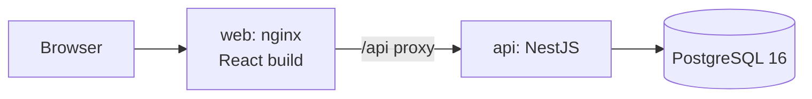

# Intelligent Inventory Dashboard

A dashboard that shows dealership managers which vehicles are costing them money and makes sure someone acts on each one.

It meets the three core requirements of the brief:

| # | Requirement | How it is met |
| --- | --- | --- |
| 1 | **Inventory visualization**: filterable list of all vehicles (make, model, age) | Inventory table with filters for make, model, year, age, age bucket, price, latest action, needs-attention badge and status; free-text search; server-side sorting and paging; filters stored in the URL (bookmarkable); CSV export of the filtered view |
| 2 | **Aging stock identification**: vehicles in stock for more than 90 days | Age is computed in SQL on every query in the dealership's timezone, so it never goes stale. Buckets: Fresh 0–30, Normal 31–60, Watch 61–90, Aging 91+. An aging section at the top of the inventory page shows count, share of stock, capital tied up and holding cost. The threshold is configurable. |
| 3 | **Actionable insights**: log and persist a status or proposed action per aging vehicle | Append-only action log (Price Reduction Planned, Price Reduced, Marketing Push, Transfer Planned, Send to Auction, Reconditioning, On Hold) with notes, target dates and new prices. Price Reduced updates the list price and price history in one transaction. Badges flag *No action*, *Stale action* and *Overdue plan*. Rule-based suggestions, bulk actions up to 100 vehicles, and 24-hour note edits. |

## Quick start

Requirements: Docker (Docker Desktop on Windows/macOS).

```bash
cp .env.example .env
docker compose up --build
```

Open **http://localhost:8080** and sign in with the demo account:

| Email | Password |
| --- | --- |
| `manager@demo.local` | `Password123!` |

The API and its Swagger docs are also exposed at http://localhost:3000/api/docs.

The database is seeded on first start with about 210 vehicles. Every date is relative to the day you run it, so the data looks the same whenever you start it.

## Architecture



- **Monorepo (pnpm):** `apps/api` (NestJS 11 + Prisma 6), `apps/web` (React 18 + Vite), `packages/shared` (business rules and API types used by both).
- **One source of truth for rules:** the web form and the API both validate actions with `validateActionInput` from `@ims/shared`. Bucket boundaries in SQL are tested against the shared `bucketFor`.
- **Aging in SQL:** one parameterised query (`vehicleSummary(now, dealershipId)`) computes age, bucket, holding cost, latest action and badges. "Now" comes from an injectable clock, so tests are deterministic.
- **Real-time:** the UI refetches on window focus and polls every 30 seconds.
- **Security:** JWT login; every query is scoped to the user's dealership, and another dealership's data returns 404.

### Data model

| Table | Purpose |
| --- | --- |
| `dealerships` | Timezone, currency, aging threshold, stale-action limit, daily holding cost |
| `employees` | Managers who sign in |
| `vehicles` | Stock with `stocked_at` (aging start), list price, purchase cost, status (in stock / sold / wholesaled) |
| `vehicle_actions` | Append-only action log; the latest row is the vehicle's current status |
| `vehicle_price_history` | Every list price change (initial, price-reduced action, manual edit) |

## Key rules

- **Age** = calendar days between `stocked_at` and today, in the dealership timezone. For sold vehicles, age is frozen at the sale date.
- **Aging** = in stock and age above the threshold (default 90 days). **Watch** = the 30 days before the threshold.
- **Holding cost so far** = age × daily holding cost. **Capital tied up** = purchase cost of aging vehicles.
- **Badges:** *No action* (aging, nothing logged), *Stale action* (latest action older than 14 days), *Overdue plan* (target date passed).
- **Suggestions:** *Never reduced* → plan a price cut; *Stale plan* → review; *Over threshold + 30 days and already reduced* → send to auction; *15 days before aging with no action* → marketing push. Each shows its reason.
- **Actions** are only logged for in-stock vehicles. They are never deleted; a note can be edited by its author for 24 hours.

## Local development

Requires Docker, Node.js 22+ and pnpm (the repo pins pnpm 10.17.0).

```bash
pnpm install
cp .env.example .env
docker compose -f docker-compose.dev.yml up -d   # Postgres only
pnpm --filter @ims/shared build
pnpm db:migrate
pnpm db:seed
pnpm dev                                          # API on :3000, web on :5173 (proxies /api)
```

| Script | Does |
| --- | --- |
| `pnpm dev` | API and web in watch mode |
| `pnpm build` | Build shared, API and web |
| `pnpm lint` / `pnpm typecheck` | ESLint / TypeScript across the repo |
| `pnpm test` | Unit tests (shared, API, web) |
| `pnpm test:e2e` | API end-to-end tests against a throwaway Postgres container |
| `pnpm db:migrate` / `pnpm db:seed` / `pnpm db:reset` | Database tasks |

## Testing

- **Shared rules** (Jest): age and bucket edges, timezone day boundaries, action rules and suggestions.
- **API end-to-end** (Jest + Supertest + Testcontainers): starts a real `postgres:16-alpine` container automatically. It covers every filter, badges, paging, the price-reduction transaction, bulk all-or-nothing, the note-edit window, dealership isolation, error shapes and the seed. **Docker must be running.**
- **Web** (Vitest + Testing Library): URL filter model, action/bulk/settings forms, table, aging section, overview links and page flows with a mocked API.
- **CI** (GitHub Actions): lint → typecheck → unit → e2e → build → Docker images → `docker compose` smoke test through nginx.

## Assumptions and trade-offs

- **Age starts when a car becomes sellable** (`stocked_at`), not when it was ordered. An inspection workflow would set this date in the full product.
- **Single dealership in the demo**, but every query is already dealership-scoped.
- **Manager role only** in the MVP; the role enum is ready for more.
- **Polling instead of push** for "real-time": simple and robust at this scale.
- **Mock prices:** list prices come from a small catalog of Vietnamese-market models in the seed.

## Roadmap: if time allows

These come from the full product vision and are designed but not built:

- **Vehicle pipeline:** Ordered → In Transit → Arrived → Inspecting → In Stock → Sold, with one state machine and a status history.
- **Trips and drivers:** truck runs, depart/arrive times, arrival condition, lot transfers that keep total age.
- **Inspector role and dashboard:** assigned inspections, a shared checklist, pass/fail with notes, re-checks after repair.
- **Needs Fix workflow:** failed steps become issues; the manager decides Repair, Accept as-is, Return or Wholesale; repair cost is added to total cost.
- **More reports with drill-down:** vehicle flow over time, stock by age bucket over time, broken vehicles per month, time per stage, inflow vs outflow.
- **Market price comparison:** a provider interface (mock first, real data later) with an "above market" suggestion.
- **Auth and operations:** refresh tokens and SSO, image release to a registry, cloud deployment with managed Postgres, structured logs and alerts, email/chat notifications, a UI end-to-end suite (Playwright).
- **Integrations:** DMS import, CSV import, a mobile-friendly inspector app.
