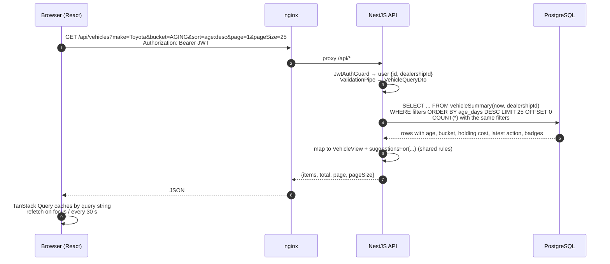
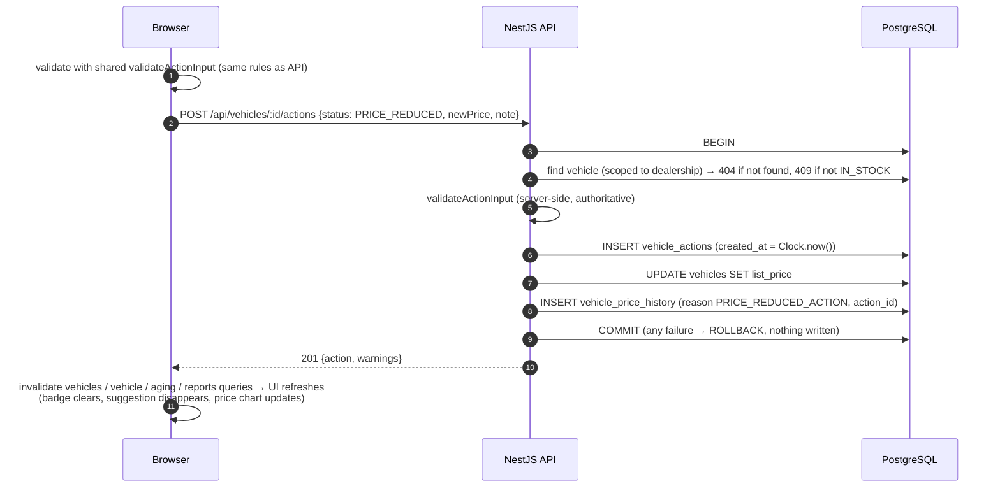
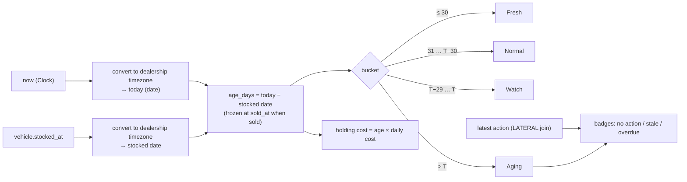

# System Design: Intelligent Inventory Dashboard

---

## 1. Context and goals

**Problem.** Every unsold car costs a dealership money each day: floorplan interest, depreciation and lot space. After about 90 days many cars are sold at a loss. Managers notice aging cars too late, and decisions such as "reduce the price" are agreed verbally and forgotten.

**Goal.** Give managers a real-time view of stock that:
1. lists and filters all vehicles (make, model, age, …);
2. automatically identifies and highlights **aging stock** (> 90 days, configurable);
3. lets them **log and persist** a status or planned action per aging vehicle, so nothing is forgotten.

**Quality goals**

| Goal | How the design meets it |
| --- | --- |
| Correctness of aging | Age is computed in SQL on every request, in the dealership's timezone; never stored, never stale |
| Traceability | Actions and price changes are append-only history |
| Scales with stock size | Server-side filtering, sorting and paging; totals via SQL aggregates |
| Easy to run and review | One command (`docker compose up`); seeded demo data; Swagger docs |
| Testable | Pure shared rules, injectable clock, end-to-end tests against real PostgreSQL |

---

## 2. Components and their roles

| Component | Location | Role |
| --- | --- | --- |
| **Web app** | `apps/web` | React single-page app for managers: Overview (KPIs, needs-attention alerts, charts), Inventory & Aging (paginated aging section, filterable table, vehicle drawer, bulk actions, CSV export), Settings. Filters and the open vehicle live in the URL. Server state is cached with TanStack Query, refetched on focus and every 30 s. |
| **nginx** | `apps/web/Dockerfile`, `nginx.conf` | Serves the static build (with long-lived caching for hashed assets), falls back to `index.html` for client-side routes, and reverse-proxies `/api` to the API. So the browser talks to one origin (no CORS). Runs as a non-root user. |
| **API** | `apps/api` | NestJS REST API. Its modules: |
| | | • `AuthModule`: login, JWT, global guard |
| | | • `VehiclesModule`: list/filter/sort/page, detail, edit, sell, wholesale, CSV export, aging summary |
| | | • `ActionsModule`: log action, bulk, note edit |
| | | • `PricingModule`: price history in the same transaction |
| | | • `ReportsModule`: overview KPIs and chart data |
| | | • `SettingsModule`: dealership settings |
| | | • `HealthModule` |
| | | Global validation pipe, uniform error shape `{statusCode, error, message, details?}`, Swagger docs. |
| **Vehicle summary query** | `apps/api/src/vehicles/vehicle-summary.sql.ts` | The heart of the design. One parameterised SQL fragment computes, per vehicle: age (dealership timezone), bucket, holding cost, latest action, "ever reduced" and the three badges. Every list, aging summary and report builds on it, so all numbers agree. |
| **Clock** | `apps/api/src/common/clock.ts` | Injectable source of "now". Production uses the system time; tests use a fixed clock, so aging results are deterministic. |
| **Shared rules** | `packages/shared` | Pure TypeScript used by both API and web: age and bucket functions, action validation rules per status, suggestion rules, enums and API response types. It is the single source of truth for business logic. |
| **PostgreSQL 16** | `postgres` container | System of record: dealerships, employees, vehicles, append-only actions and price history. Its date and timezone functions power the aging calculation. |
| **Seed** | `apps/api/src/seed` | Deterministic demo data (~210 vehicles) with dates relative to the run day, so the demo always shows every bucket, badge and suggestion. |
| **CI** | `.github/workflows/ci.yml` | Lint → typecheck → unit → end-to-end (Testcontainers) → build → Docker images → Compose smoke test through nginx. |

---

## 3. Data flow

### 3.1 Reading the inventory (requirements 1 and 2)

- The filters come from the URL, so the same view can be bookmarked or shared.
- The aging section works the same way: `GET /api/vehicles/aging` returns one SQL aggregate (count, % of stock, capital tied up, holding cost), and the lists come from `GET /api/vehicles?bucket=AGING|WATCH`, 10 per page. The Watch list loads only when expanded.

### 3.2 Logging an action (requirement 3)

Bulk actions (`POST /api/actions/bulk`, up to 100 vehicles) follow the same pattern in one transaction. Every vehicle is checked first, so the batch is all-or-nothing.

### 3.3 How aging is computed (inside the summary query)

`T` is the dealership's aging threshold (default 90). Integration tests assert that the SQL bucket logic agrees with the shared `bucketFor()` at every boundary.

### 3.4 Authentication

1. `POST /api/auth/login` checks the email and bcrypt password, and returns a JWT (8 h) carrying `sub`, `role` and `dealershipId`.
2. The web app stores the token and sends `Authorization: Bearer …` with every request.
3. The global guard verifies the token. Every query uses `dealershipId` from the token.
4. A 401 clears the token and returns the user to the login page.

---

## 4. Technologies and justifications

| Layer | Choice | Why |
| --- | --- | --- |
| Language | **TypeScript** everywhere | One language across API, web and shared rules; response types are shared, so API/UI drift is caught at compile time |
| Monorepo | **pnpm workspaces** | Shared package without publishing; one lockfile; fast installs |
| API framework | **NestJS 11** | Modules, dependency injection (used for the testable `Clock`), guards, DTO validation and Swagger built in; a clear structure for reviewers |
| Database | **PostgreSQL 16** | Relational data with transactions (the price-reduction atomicity); timezone-aware date maths, `LATERAL` joins and `FILTER` aggregates make the aging calculation one query |
| Data access | **Prisma 6** + parameterised raw SQL | Type-safe CRUD and migrations; raw SQL where Postgres features matter (aging summary). Parameters prevent SQL injection |
| Validation | **class-validator** (API) + **zod** (web) + shared `validateActionInput` | DTO shape validation at the edge; business rules defined once and used by both sides |
| Auth | **JWT** (`@nestjs/jwt`) + **bcrypt** | Stateless, simple for a single-role MVP; dealership scope travels in the token |
| Frontend | **React 18 + Vite** | Fast dev loop and build; a large ecosystem |
| Server state | **TanStack Query** | Caching, background refetch (the "real-time" behavior) and invalidation after mutations |
| Tables | **TanStack Table** | Headless and fully controlled, which fits server-side sorting and paging |
| Forms | **React Hook Form + zod** | Performant forms; zod runs the shared business rules |
| UI | **Tailwind CSS 4**, Radix Dialog, Recharts | Quick, consistent styling; accessible dialogs and drawer; clickable charts |
| Web serving | **nginx (unprivileged)** | Tiny, fast static server plus reverse proxy (single origin, no CORS), runs as non-root |
| Tests | **Jest, Supertest, Testcontainers, Vitest, Testing Library** | Unit tests for rules; **real PostgreSQL** in end-to-end tests so the SQL is exercised; component tests for UI behavior |
| Packaging | **Docker** multi-stage images, **Docker Compose** | One command to run the whole system; small runtime images |
| CI | **GitHub Actions** | Runs the full pipeline and a Compose smoke test on every pull request |

---

## 5. Observability strategy

Observability rests on three pillars (**logs, metrics, traces**) plus health checks and alerting. Section 5.1 describes what the MVP has today; sections 5.2–5.5 are the plan for production. They are designed so the MVP code does not need to be restructured.

### 5.1 Implemented in the MVP

| Signal | Implementation |
| --- | --- |
| Health | `GET /api/health` checks database connectivity; Docker healthchecks on `postgres` (`pg_isready`), `api` (`/api/health`) and `web`; Compose starts services in dependency order |
| Error logging | A global exception filter returns a uniform error shape and logs unexpected (500) errors with stack traces through the NestJS logger |
| Application logs | NestJS logger (startup, routes, errors) to stdout, visible with `docker compose logs -f api` |
| Web server logs | nginx access and error logs to stdout |
| API contract | Swagger at `/api/docs` |
| Pipeline checks | CI smoke test brings the stack up and calls health, login and overview through nginx |

### 5.2 Logging (production)

- **Structured JSON logs** with `pino` (via `nestjs-pino`) to stdout, collected by the platform (CloudWatch Logs / Cloud Logging / Loki).
- **One log line per request**, with these fields:
  - `timestamp`, `level`, `requestId` (from the `X-Request-Id` header or generated)
  - `traceId` / `spanId` (from OpenTelemetry), `method`, `route` (templated, e.g. `/vehicles/:id`), `status`, `durationMs`
  - `dealershipId`, `userId`
- **Domain events** logged at `info`, so business activity can be audited and counted: `action.logged`, `action.bulk_logged`, `price.changed`, `vehicle.sold`, `settings.changed`.
- **Never log** passwords, tokens or full request bodies. Redact the `authorization` and `password` fields.
- nginx forwards and logs `X-Request-Id`, so a browser request can be followed through nginx to the API.

### 5.3 Metrics (production)

Exposed through the OpenTelemetry SDK (or `prom-client` at `/metrics`), scraped by Prometheus / CloudWatch / Cloud Monitoring.

| Type | Metric | Why |
| --- | --- | --- |
| Database | query duration, connection-pool usage, slow queries (Postgres `pg_stat_statements`) | The aging query is the hot path |
| Runtime | Node event-loop lag, heap, CPU; container restarts | Capacity and stability |
| Business | `vehicles_in_stock`, `vehicles_aging`, `aging_capital_tied_up`, `needs_attention{type}` (gauges, per dealership); `actions_logged_total{status,source}`; suggestion acceptance rate (`source=SUGGESTION` / all) | Shows whether the product works: is aging stock going down, and are suggestions used |
| Frontend | Web Vitals (LCP, INP, CLS) and JS errors via a browser SDK (e.g. Sentry / OpenTelemetry web) | User-perceived performance |

### 5.4 Tracing (production)

- **OpenTelemetry** auto-instrumentation for HTTP, NestJS and `pg` / Prisma. Each request becomes a trace:
  nginx → API handler → service → SQL queries.
- The trace context is propagated from the browser (`traceparent` header) where the frontend SDK is enabled.
- Traces are exported via OTLP to AWS X-Ray, Google Cloud Trace, Grafana Tempo or Jaeger.
- Trace IDs are included in logs, so an error log links to its trace and a slow trace shows which SQL query was slow.
- **Sampling:** 100% of errors, about 10% of successful requests.

### 5.5 Dashboards, SLOs and alerts

**Dashboards**
- API overview (RED per route, p95 latency, error rate)
- Database (connections, slow queries)
- Business (aging trend, needs-attention counts, actions per day)

**SLOs**

| SLO | Target |
| --- | --- |
| API availability | 99.9% monthly (successful non-5xx responses) |
| Read latency | p95 < 300 ms for `GET /vehicles` and `GET /vehicles/aging` |
| Write latency | p95 < 500 ms for `POST /actions` |

**Alerts** (to on-call chat or pager)
- 5xx rate > 2% for 5 min
- p95 latency above SLO for 10 min
- health check failing
- DB connections > 80% of the pool
- error-budget burn rate too high

**Business alert** (email digest to managers)
- aging vehicles with no action for more than 48 h

---

## 6. How GenAI assisted the design phase

I used **Claude Code** as a design partner (with structured brainstorming and planning skills), and **opencode** later as the implementer. In the design phase the AI:

1. **Stress-tested my initial idea document.** I had written a large product vision: vehicle pipeline, trips and drivers, inspections, repair loop and market pricing. Reading it against the brief, the AI pointed out that the scope was far beyond the three requirements. It also found **contradictions** in my draft, for example:
   - "several open issues per car" could never happen under my own inspection rules;
   - lot transfers had no valid path in my state machine;
   - some tables lacked a dealership column, which broke my own data-isolation rule.
2. **Framed decisions as explicit questions, one at a time**, with a recommended option and trade-offs. The questions covered:
   - the purpose and time budget (a take-home with a deadline);
   - the scope tier (I chose "Core+": the three requirements done well, the rest in the roadmap);
   - the stack;
   - the level of authentication.
3. **Proposed alternative architectures for the key problem** (where to compute aging): a database view, application code, or stored columns updated nightly. It recommended SQL computed on read. During planning it refined that to a **parameterised query with an injectable clock**, because a view can't be tested at a fixed "now".
4. **Suggested testing with real infrastructure.** When I asked for tests against a real PostgreSQL that start automatically, it proposed **Testcontainers**, which runs the same way locally and in CI.
5. **Turned the design into a written spec and executable plans:** global constraints, file layout, interfaces between tasks, and test-first steps. A second agent could then implement it task by task, and I could review each step.
6. **Kept the design honest during verification.** Browser testing showed the aging list would not scale to 10,000 cars. The AI proposed changing the API contract (a summary computed in SQL, plus paginated lists) rather than patching the UI, and wrote that change up as its own plan.

**My role:** I made every decision. I accepted or rejected recommendations and verified each result myself: tests, Docker, and a manual walkthrough. I also asked for changes when something didn't fit, for example turning a vague "real-time" into focus-refetch plus 30-second polling, and removing AI attribution from commit messages.

---